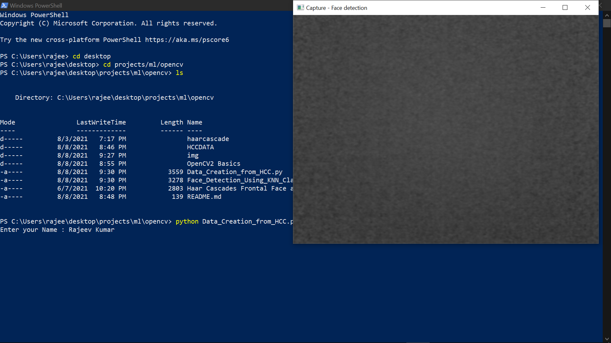

# Face_Detection_and_Identification
Face Detection and Identification using KNN Classifier Algorithm and Haarcascade Frontal face Model.

## Requirements :
- ### Python, NumPy, OpenCV2
- ### WebCam Permission

## Use :
- ### Run (Data Creation from HCC.py)

- ### Enter the name of the person in the frame.

- ### Let it capture approx 40-50 snips. (more snips will increase accuracy)
- ### Press q to exit capture mode.

- ### Run (Face Detection Using KNN Classifier and HCC FFModel.py)

- ### Put the persons in the frame, it will recognize their names.
